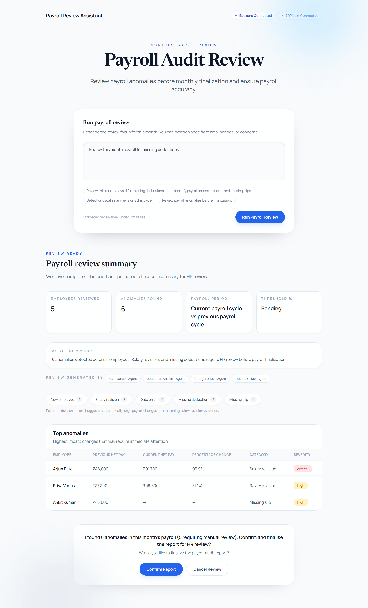

# Payroll Anomaly Detector

AI-assisted payroll audit system built with **FastAPI**, **Agno multi-agent orchestration**, and **ERPNext payroll analysis**.

The system compares current and previous payroll cycles, detects payroll anomalies, pauses for human review (HITL), and generates a structured HR audit report before payroll finalization.

---

# Repository


https://github.com/AnkitByteForge/payroll-anomaly-detector


---

# Problem Statement

Before payroll is finalized each month, HR teams manually review salary slips to identify:

* unusual salary changes
* missing deductions
* payroll inconsistencies
* missing salary slips
* newly onboarded employees

This process is repetitive, time-consuming, and error-prone.

This system automates payroll comparison and anomaly detection while preserving a mandatory human approval checkpoint before payroll finalization.

---

# Features

* ERPNext payroll integration
* Multi-agent orchestration using Agno
* Deterministic anomaly detection
* Human-in-the-loop confirmation workflow
* Structured anomaly categorization
* FastAPI backend
* React frontend
* Payroll audit reporting
* Session-based review history

---

# System Architecture


┌──────────┐     POST /api/v1/run      ┌─────────────────────┐
│  User UI │ ─────────────────────────▶│   FastAPI Backend   │
│          │                           │   routes/agent.py   │
│          │◀─ awaiting_confirmation ──│                     │
│          │   or final_report         └────────┬────────────┘
│          │                                    │
│  CONFIRM │── POST /api/v1/confirm ───────────▶│
└──────────┘                                    │
                                                ▼
                                    ┌───────────────────────┐
                                    │      Agno Team        │
                                    │     agents/team.py    │
                                    │  mode="coordinate"    │
                                    └──────────┬────────────┘
                                               │
                                               ▼
                                    ┌───────────────────────┐
                                    │  PayrollOrchestrator  │
                                    │ agents/orchestrator.py│
                                    └──────────┬────────────┘
                                               │
                                               ▼
                                    ┌───────────────────────┐
                                    │    DataFetchAgent     │
                                    └──────────┬────────────┘
                                               │
                                               ▼
                                    ┌───────────────────────┐
                                    │   ERPNext Tools       │
                                    │ tools/erpnext_tools   │
                                    └──────────┬────────────┘
                                               │
                                               ▼
                                    ┌───────────────────────┐
                                    │     ERPNext API       │
                                    │        (REST)         │
                                    └──────────┬────────────┘
                                               │
                                               ▼
                         ┌─────────────────────────────────────────────┐
                         │         Payroll Analysis Agents            │
                         └─────────────────────────────────────────────┘
                                               │
                    ┌──────────────────────────┼──────────────────────────┐
                    ▼                          ▼                          ▼
          ┌────────────────┐       ┌────────────────┐       ┌────────────────┐
          │ComparisonAgent │       │AnomalyDetector │       │Categorization  │
          │                │       │     Agent      │       │     Agent      │
          └────────────────┘       └────────────────┘       └────────────────┘
                                               │
                                               ▼
                                    ┌───────────────────────┐
                                    │  ReportBuilderAgent   │
                                    └──────────┬────────────┘
                                               │
                                               ▼
                                    ┌───────────────────────┐
                                    │      HITL Pause       │
                                    │ session_id persisted  │
                                    │ awaiting_confirmation │
                                    └──────────┬────────────┘
                                               │ confirm=true
                                               ▼
                                    ┌───────────────────────┐
                                    │     Final Report      │
                                    │     JSON Response     │
                                    └───────────────────────┘


---

# ERPNext Module Coverage

This system focuses on the **Payroll module** in ERPNext.

Primary ERPNext entities used:

* Salary Slips
* Employee Records
* Earnings Components
* Deduction Components
* Payroll Period Data

The system compares current and previous payroll cycles using ERPNext salary slip records.

---

# Agno Team Design

The project uses **Agno** to coordinate multiple specialist agents responsible for different stages of payroll analysis.

Agents include:

* DataFetchAgent
* ComparisonAgent
* AnomalyDetectorAgent
* CategorizationAgent
* ReportBuilderAgent

The system uses Agno’s `coordinate` team mode because the workflow requires multiple independent analysis stages operating on the same payroll dataset while preserving centralized orchestration and deterministic business rules.

The actual execution logic remains deterministic inside the `PayrollOrchestrator`, while Agno provides the modular multi-agent coordination layer required for structured payroll analysis.

---

# Human-in-the-Loop (HITL) Flow

Before finalizing the payroll audit report, the system pauses for manual HR confirmation.

The HITL pause is triggered after:

* payroll comparison
* anomaly detection
* anomaly categorization
* audit summary generation

The user is shown:

* total employees reviewed
* total anomalies detected
* category breakdown
* top anomalies by impact
* suggested HR actions

The frontend then presents:

* Confirm Report
* Cancel Review

If confirmed:

* the workflow resumes
* the final structured report is generated
* the audit session is stored

If cancelled:

* the review session is discarded
* no report is finalized

---

# Anomaly Detection Logic

The system compares:

* gross pay
* deductions
* net pay

Employees are flagged when payroll changes exceed the configured threshold.

## Current Threshold

* 15% payroll variance

## Supported Anomaly Categories

| Category             | Description                                         |
| -------------------- | --------------------------------------------------- |
| Salary Revision      | Large payroll change likely caused by salary update |
| Missing Deduction    | Expected deduction component missing                |
| Missing Slip         | Current or previous salary slip unavailable         |
| New Employee         | No previous payroll history exists                  |
| Potential Data Error | Large unexplained payroll discrepancy               |

---

# Frontend Capabilities

The frontend:

* communicates only with the FastAPI backend
* never directly calls ERPNext
* handles HITL confirmation flow
* displays structured anomaly summaries
* renders payroll anomaly tables
* shows agent involvement in report generation
* supports confirm/cancel audit workflow

---

# API Endpoints

| Endpoint          | Method | Purpose                    |
| ----------------- | ------ | -------------------------- |
| `/api/v1/health`  | GET    | Health check               |
| `/api/v1/run`     | POST   | Start payroll audit        |
| `/api/v1/confirm` | POST   | Confirm or cancel HITL     |
| `/api/v1/history` | GET    | Retrieve previous sessions |

---

# Project Structure

```text id="b3z9km"
payroll-anomaly-detector/
│
├── backend/
│   ├── agents/
│   ├── routes/
│   ├── services/
│   ├── tools/
│   ├── schemas/
│   ├── session_store/
│   └── main.py
│
├── frontend/
│
├── requirements.txt
├── README.md
├── SETUP.md
└── .env.example
```

---

# Screenshots

## Payroll Review Dashboard



---

## HITL Confirmation Flow


---

## Final Payroll Audit Report


---

## Video demo
https://www.loom.com/share/5ee5ac69bdc44774b69e156534557c54


# Setup Instructions

Detailed setup instructions are available in:


SETUP.md


---

# Future Improvements

* Dynamic payroll period selection
* Exportable PDF audit reports
* Real ERPNext production deployment
* Payroll trend analytics
* Role-based HR review access

---

# Notes

* The frontend communicates only with the FastAPI backend.
* No direct ERPNext calls are made from the frontend.
* Business rules and anomaly thresholds remain deterministic.
* Agno coordinates specialist agents for modular payroll analysis.
* No secrets are hardcoded in the repository.

---

# License

MIT License
